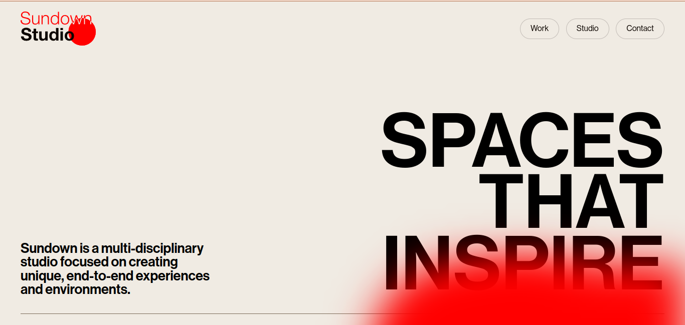
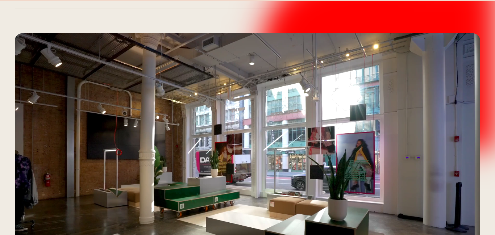
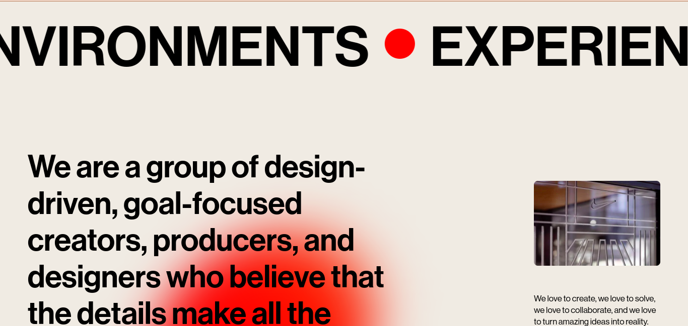
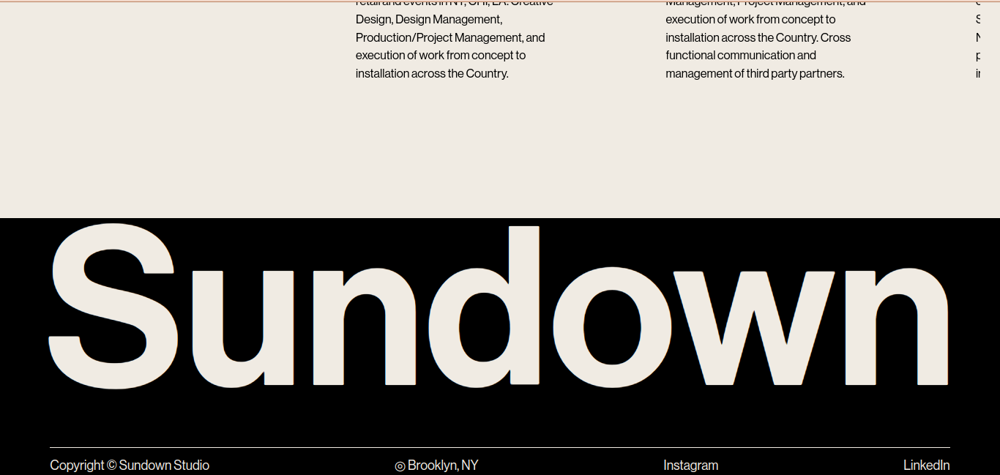
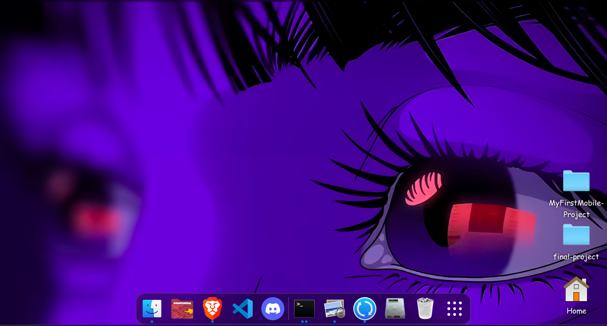

# Sundown Studio

A showcase website for Sundown Studio with interactive sections and media content.

## Features
- Responsive design
- Includes videos and images
- Uses modern web development practices

---

## Screenshots

### Home Section

### Second Section

### Third Section

### Footer Section

---

## Usage
Open the `index.html` file in any browser to view the project locally.

## Hosting
The project can be hosted on GitHub Pages for easy access.

